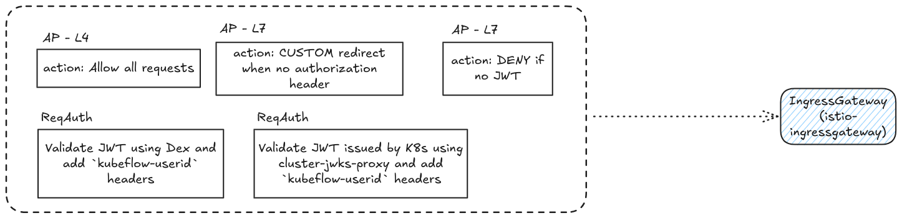
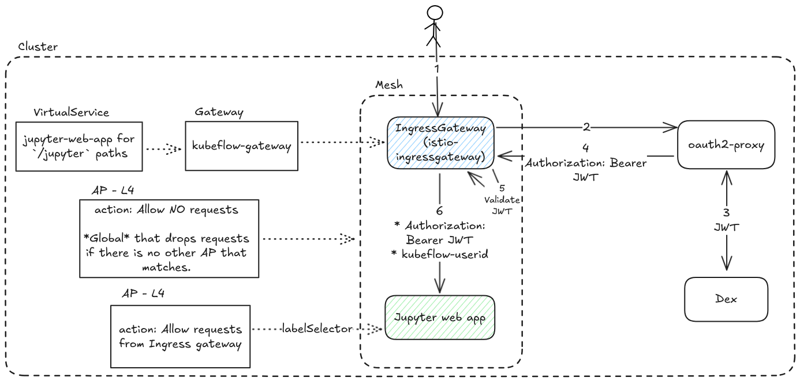

# Use case a - Web application access through the UI

Those manifests are needed to enable:
1. Log in flow through the UI.

2. Access a web application through the UI (jupyter-web-app) in this case.


> [!NOTE]
> The diagrams are used to indicate the request flow and do not correspond exactly to the manifests from this repo. Those include the resources used in sidecar mode.

## Requirements
1. A [clean setup](../clean-setup/).

## Instructions
Apply manifests from this directory using:
```shell
kustomize build . | kubectl apply -f -
```
Note that:
1. The `strict-pa-kubeflow` PeerAuthentication (that set mTLS mode to `strict`) is not a requirement for Kubeflow and thus excluded from the `kustomization.yaml` file. It was used to test the setup's compatibility with strict mTLS mode.
1. The waypoint and its corresponding AuthorizationPolicy are deployed to demonstrate the proposed setup. However, no services need to be enrolled to support this use case.

## Results
You should be able to login, access the Notebooks web app and send a create notebook request. This is possible from `localhost:8080` with
```shell
kubectl -n istio-system port-forward svc/ambient-ingressgateway-istio 8080:80
```

The expected istio resources are:
```
$ kubectl get ap -A
NAMESPACE                   NAME                                    ACTION   AGE
istio-system                ambient-ingressgateway                  ALLOW    3d3h
istio-system                ambient-ingressgateway-oauth2-proxy     CUSTOM   47h
istio-system                ambient-ingressgateway-require-jwt      DENY     47h
istio-system                global-allow-noting-deny-all                     3d4h
istio-system                waypoint-allow-nothing                           2d2h
kubeflow-user-example-com   ml-pipeline-visualizationserver                  4d2h
kubeflow-user-example-com   ns-owner-access-istio                            4d2h
kubeflow                    centraldashboard-l4-ingressgateway   ALLOW    2d1h
kubeflow                    jwa-l4-ingressgateway                         ALLOW    47h
kubeflow                    profiles-l4-centraldashboard                    ALLOW    47h

$ kubectl get requestauthentications.security.istio.io -A
NAMESPACE      NAME      AGE
istio-system   dex-jwt   47h

$ kubectl get httproutes -A                              
NAMESPACE      NAME               HOSTNAMES   AGE
auth           dex                            3d5h
kubeflow       centraldashboard               3d23h
kubeflow       jupyter-web-app                3d23h
oauth2-proxy   oauth2-proxy                   3d5h
```

## Manifests explanation
This was copied from https://github.com/canonical/bundle-kubeflow/issues/1285#issuecomment-3056440427.

### Gateway + waypoint setup
Ambient mesh allows to define your own gateway-waypoint architecture. This means that it's up to the product to define the number of waypoints (if any) in a cluster and which namespaces,services and workloads are subscribed to each waypoint.

#### Number of waypoints and waypoint assignment
Waypoints will be used only where necessary. Most of the components in the `kubeflow` namespace use L4 AuthorizationPolicies. Only the APs attached to `ml-pipeline` and `ml-pipeline-ui` make use of L7 features. In order to vastly improve network efficiency (see [[1]](https://ambientmesh.io/blog/sidecar-migration-part-1/#to-waypoint-or-not-to-waypoint) and [[2]](https://istio.io/latest/blog/2025/ambient-performance/)), only services that need the L7 features will be enrolled in a waypoint. The use of waypoints in user namespaces will be explored in a follow up task (#1304). This design also comes with the added benefit of **not** proxying all traffic through a single deployment (waypoint).

This suggest setup becomes possible with the use of the labels `istio.io/dataplane-mode: ambient` on the `kubeflow` namespace and `istio.io/use-waypoint: kubeflow-waypoint` on the specific services, where `kubeflow-waypoint` is the name of the waypoint resource in the `kubeflow` namespace..

#### Waypoint traffic type
During the waypoint deployment, there is this label that configures the waypoint traffic type.
```
    istio.io/waypoint-for: service
```
This can be take the [following values](https://istio.io/latest/docs/ambient/usage/waypoint/#waypoint-traffic-types). We decide to go with the default one (`service`) since:
1. All kubeflow components are expected to hit services rather than pod IPs
2. Using `waypoint-for: all` prevents from applying APs bound to specific pods (see [canonical/istio-beacon-k8s-operator#76](https://github.com/canonical/istio-beacon-k8s-operator/issues/76#issuecomment-2971331539)). In order to enable observability though, Prometheus need to be allowed to hit pods specifically. Thus, keeping `waypoint-for: services` enables us to define L4 AuthorizationPolicy CRs bound to specific pods, since those are served by zTunnel.

#### Policy enforcement place
One of the goals of the design is to provide something that's simple, secure and easy to reason about. For components that are:
* not enrolled to a waypoint, the policy enforcement point is the receiving (server-side) ztunnel proxy in the path of a connection. [[1]](https://ambientmesh.io/docs/security/ztunnel-authz/#:~:text=The%20enforcement%20point%20is%20the%20receiving%20(server%2Dside)%20ztunnel%20proxy%20in%20the%20path%20of%20a%20connection.)
* enrolled to a waypoint, the policy enforcement point is the waypoint, while on an L4 layer, they will accept traffic only from the waypoint, and maybe the IngressGateway, if this is needed.

All enforcement places are protected via with a default deny (allow nothing) policy.

For services enrolled to waypoint, it is **not recommened** to enable [ingress waypoint routing](https://ambientmesh.io/docs/traffic/gateways/#gateways-and-waypoints) so that traffic from the gateway is sent to the configured waypoint, rather than the workload itself. The reason for this is that:
1. Istio can be preconfigured in a cluster where Kubeflow is deployed and this label requires the istio-wide  [ENABLE_INGRESS_WAYPOINT_ROUTING](https://istio.io/latest/docs/reference/commands/pilot-discovery/#:~:text=ENABLE_INGRESS_WAYPOINT_ROUTING) flag to be set. We should avoid requiring istio-wide configurations for KF to be functional. Note that when enabling ambient, this is enabled by default (see https://github.com/istio/istio.io/issues/16649). However, this can be still be disabled.
2. More network overload due to multiple workloads being involved (instead of GW -> workload, we have GW -> Waypoint -> SVC -> workload)

This means that for those two services, we **may** need to apply some duplicate AuthorizationPolicy CRs if a workload is expected to be targeted both via the IngressGateway and via their service, but this is not a big downside. Reasoning about the authorization story is not affected greatly.

#### Allow traffic from waypoint to service and `PILOT_AUTO_ALLOW_WAYPOINT_POLICY` flag
In order for a waypoint to be able to forward requests to the services, there needs to be an L4 AuthorizationPolicy that allows traffic from the waypoint to each service that is subscribed to it. By default, those APs need to be created manually. Istio also provides also the [PILOT_AUTO_ALLOW_WAYPOINT_POLICY](https://istio.io/latest/docs/reference/commands/pilot-discovery/#:~:text=PILOT_AUTO_ALLOW_WAYPOINT_POLICY) flag. When enabled (installing with `--set "values.pilot.env.PILOT_AUTO_ALLOW_WAYPOINT_POLICY=true"`), zTunnel will receive synthetic authorization policies for each workload to ALLOW the Waypoint's identity. However, similarly to the usage of `ingress-use-waypoint` label, this should be avoided as it sets adds an istio-wide requirement from Kubeflow. Another downside of this flag is that those AuthorizationPolicies are not visible in k8s, which makes the Authorization story less transparent.
