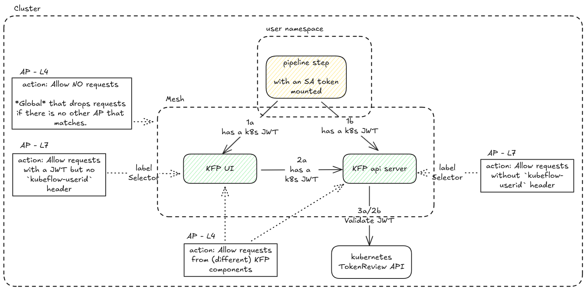

# Use case b - KFP components access from a user’s pods

Those manifests are needed to enable accessing the KFP components from a user's pods. Note that the user pods are authorized by the KFP api server using a k8s JWT.



In this scenario, the pipeline step pod in the user’s namespace may send a request either to KFP UI or the api server including a k8s JWT from the mounted SA token. When KFP UI receives such a request, it forwards it to the KFP api-server. The JWT is validated with a request to k8s’ TokenReview API.

> [!NOTE]
> The diagram is used to indicate the request flow and does not correspond exactly to the manifests from this repo. It includes the resources used in sidecar mode.

## Requirements
1. A [clean setup](../clean-setup/).
2. Manifests from [use case a - Web application access](../use-case-a/)

## Instructions
1. Enroll `ml-pipeline` and `ml-pipeline-ui` services in the waypoint.
```sh
kubectl -n kubeflow label svc ml-pipeline istio.io/use-waypoint=kubeflow-waypoint 
kubectl -n kubeflow label svc ml-pipeline-ui istio.io/use-waypoint=kubeflow-waypoint
```
2. Add the user namespace to ambient mesh and disable sidecar injection
```sh
kubectl label ns kubeflow-user-example-com istio.io/dataplane-mode=ambient
kubectl label ns kubeflow-user-example-com istio-injection-
```
3. Disable sidecar injection in kfp-profile-controller
```sh
kubectl patch -n kubeflow cm kubeflow-pipelines-profile-controller-env-5252m69c4c --type=strategic -p '{"data": {"DISABLE_ISTIO_SIDECAR": "true"}}'
```
4. Delete existing pods in user namespace
```sh
kubectl delete pod -n kubeflow-user-example-com ml-pipeline-uiartifact-*
kubectl delete pod -n kubeflow-user-example-com ml-pipeline-visualizationserver-*
# ensure there is no sidecar (pods should have one container)
kubectl get pod -n kubeflow-user-example-com ml-pipeline-uiartifact-*
kubectl get pod -n kubeflow-user-example-com ml-pipeline-visualizationserver-*
```
5. Apply manifests from this directory using:
```sh
kustomize build . | kubectl apply -f -
```

## Results
1. Port-foward the ingressGateway using
```shell
kubectl -n istio-system port-forward svc/ambient-ingressgateway-istio 8080:80
```
2. Access the UI at http://localhost:8080
3. Go to pipelines web app.
4. Create a new experiment
5. Create a new run (use the Data passing from the shared ones, the Control structure fails even with sidecar).

It should succeed without issues. This showcases that pipeline step pods in user namespace can access the KFP components, otherwise the pipeline would fail.

The expected istio resources are:
```
$ kubectl get ap -A
NAMESPACE                   NAME                                       ACTION   AGE
istio-system                ambient-ingressgateway                     ALLOW    127m
istio-system                ambient-ingressgateway-oauth2-proxy        CUSTOM   127m
istio-system                ambient-ingressgateway-require-jwt         DENY     127m
istio-system                global-allow-nothing-deny-all                       127m
istio-system                waypoint-allow-nothing                              127m
kubeflow-user-example-com   ml-pipeline-visualizationserver                     44m
kubeflow-user-example-com   ns-owner-access-istio                               44m
kubeflow                    admission-webhook-l4-allow-all             ALLOW    45m
kubeflow                    centraldashboard-l4-ingressgateway         ALLOW    127m
kubeflow                    jwa-l4-ingressgateway                      ALLOW    127m
kubeflow                    katib-controller-l4-allow-all              ALLOW    45m
kubeflow                    kfp-profile-controller-l4-metacontroller   ALLOW    45m
kubeflow                    metadata-envoy-l4-ingressgateway           ALLOW    45m
kubeflow                    metadata-grpc-service                      ALLOW    45m
kubeflow                    minio-service                              ALLOW    45m
kubeflow                    ml-pipeline-l4-waypoint                             45m
kubeflow                    ml-pipeline-l7                                      45m
kubeflow                    ml-pipeline-ui                                      45m
kubeflow                    ml-pipeline-ui-l4-waypoint                          45m
kubeflow                    ml-pipeline-ui-l7                                   45m
kubeflow                    ml-pipeline-visualizationserver                     45m
kubeflow                    mysql                                               45m
kubeflow                    profiles-l4-centraldashboard               ALLOW    127m
kubeflow                    service-cache-server                                45m


$ kubectl get requestauthentications.security.istio.io -A 
NAMESPACE      NAME      AGE
istio-system   dex-jwt   127m

$ kubectl get httproutes -A
NAMESPACE      NAME               HOSTNAMES   AGE
auth           dex                            127m
kubeflow       centraldashboard               127m
kubeflow       jupyter-web-app                127m
kubeflow       metadata-envoy                 46m
kubeflow       ml-pipeline-ui                 46m
oauth2-proxy   oauth2-proxy                   127m
```

## Manifests explanation

### Where is the user waypoint?
We plan to use a waypoint in user namespaces but for this use case it was not needed. When added, it won't affect traffic **from** the user pods to KFP, rather only incoming traffic **to** user pods.

### Existing AuthorizationPolicy resources
The `kfp-ap-*` files are the ones already present in Kubeflow:
1. `kfp-ap-l4.yaml` are untouched APs used in sidecar mode
2. `kfp-ap-l4-waypoint.yaml` and `kfp-ap-l7.yaml` are the migrated versions for `ml-pipeline` and `ml-pipeline-ui` services that are enrolled to the waypoint.

### New AuthorizationPolicy resources
Many components were previously outside the mesh (ie had no sidecars), which means that they allowed all traffic. Since the whole `kubeflow` namespace is in-mesh now, new AuthorizationPolicy resources need to be introduced to allow specific traffic.

1. Access from `metacontroller` to `kfp-profile-controller`. Otherwise, we were seeing errors like this
```sh
2025-07-09T12:42:31.417947Z	error	access	connection complete	src.addr=10.1.217.40:49048 src.workload="metacontroller-0" src.namespace="kubeflow" src.identity="spiffe://cluster.local/ns/kubeflow/sa/meta-controller-service" dst.addr=10.1.217.3:15008 dst.hbone_addr=10.1.217.3:8080 dst.service="kubeflow-pipelines-profile-controller.kubeflow.svc.cluster.local" dst.workload="kubeflow-pipelines-profile-controller-699dc67f96-mkstm" dst.namespace="kubeflow" dst.identity="spiffe://cluster.local/ns/kubeflow/sa/default" direction="outbound" bytes_sent=0 bytes_recv=0 duration="1ms" error="http status: 401 Unauthorized"
```
2. Acess from everyone to katib-controller and admission-webhook. This is needed to allow Kubernetes API to talk to those controllers. Kubernetes is expected to send a request to the Webhook before persisting changes in etcd to confirm if it needs to modify the object. Note that it is not possible to have more fine-grained access from outside the mesh (ie Kubernetes API) since Istio only has TCP connection attributes for off-mesh traffic (ie Source IP and Destination port). Ztunnel logs have other attributes manually (like source namespace, workload etc) for easier debugging. [Talking to upstream Istio team](https://istio.slack.com/archives/C041EQL1XMY/p1752160919990969?thread_ts=1752144421.301679&cid=C041EQL1XMY), they mentioned that
> The issue is that all we really know is the src IP of this connection. IPs are not really fixed in kube and it's possible we have old information about what has that IP. This is why we only trust cryptographic verifiable workload information for auth.

Before introducing those APs, we were seeing errors similar to the following: 
```sh
2025-07-08T12:42:04.862441Z    error    access    connection complete    src.addr=192.168.2.8:4956 dst.addr=10.1.217.57:4443 dst.service="admission-webhook-service.kubeflow.svc.cluster.local" dst.workload="admission-webhook-deployment-67fd864794-vpgh2" dst.namespace="kubeflow" direction="inbound" bytes_sent=0 bytes_recv=0 duration="0ms" error="connection closed due to policy rejection: allow policies exist, but none allowed"
# kubectl get pods -A | grep  192.168.2.8 
kube-system                 calico-node-sdcrk          1/1     Running            0                146m   192.168.2.8
metallb-system              speaker-mm2kp              1/1     Running            0                145m   192.168.2.8
```

3. Access from IngressGateway to metadata envoy. This is needed to enable accessing KFP runs' metadata.


### HTTPRoutes
The VirtualServices needed were migrated. For metadata-envoy, there was the subtle difference in path:
```diff
    - path:
        type: PathPrefix
-        value: /ml_metadata
+        value: /ml_metadata.MetadataStoreService
```
This worked previously since Istio's VirtualService is built specifically to work well with gRPC and Envoy, while HTTPRoutes are more generic resources and treat the path more strictly.


## Known and unrelated issues
1. During restarts of the node, Ambient mesh can act weird and not enroll namespaces/services to mesh. This is resolved by unlabeling and labeling again namespaces (in our case) with the ambient label. See https://github.com/istio/istio/issues/56729. This was happening on most laptop reboots in my case.
2. There is a bug in KFP 2.5.0 where it fails previewing pipeline step artifcats from the UI (see https://github.com/kubeflow/pipelines/issues/12041).
