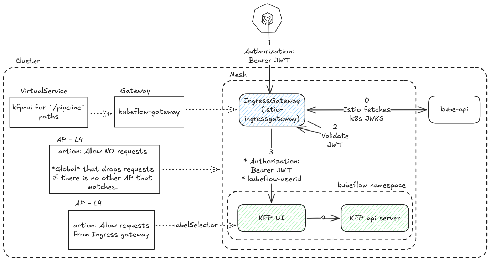

# Use case c - Enable programmatic access using k8s token
This use case enables programmatic access from outside the cluster to:
1. KFP api (via KFP UI)

2. user workloads


With those manifests, we also confirm the following use cases:
1. (some) KFP components allow all requests

2. Services in the user namespace accept requests from:
    1. Everyone in the same namespace
    2. IngressGateway and KFP-UI with specific headers.

> [!NOTE]
> These diagrams are used to indicate the request flow and do not correspond exactly to the manifests from this repo. They include the resources used in sidecar mode.

## Requirements
1. A [clean setup](../clean-setup/).
2. Manifests from [use case a - Web application access](../use-case-a-web-application-access)
3. Manifests from [use case b - KFP access from a user’s pods](../use-case-b-kfp-from-user-pods-access)

## Instructions
1. Enroll the user namespace `kubeflow-user-example-com` to the waypoint to be created
    ```sh
    kubectl label ns kubeflow-user-example-com istio.io/use-waypoint=waypoint # `waypoint` is the custom resource name (user-waypoint.yaml)
    kubectl label ns kubeflow-user-example-com istio.io/ingress-use-waypoint=true
    ```
2. Optionally, you can create a second profile to enable testing networking between user namespaces. For this, follow instructions from my-profile directory [README](./my-profile/README.md) file.
3. Given that all profiles have been created, we need to configure kubeflow's `profile-controller` and `kubeflow-pipeline-profile-controller` components to not recreate AuthorizationPolicy resources when we delete them.
    1. Scale down kubeflow-pipelines-profile-controller
        ```sh
        kubectl scale deployment -n kubeflow kubeflow-pipelines-profile-controller --replicas=0
        ```
    2. For kubeflow profile-controller, we won't scale it down because that will prevent us from authenticating in the Kubeflow UI. Instead, we 'll modify its RBAC roles so it can do everything apart from manipulating AuthorizationPolicies
        ```sh
        # Deletion is needed because the roleRef cannot be modified in an existing clusterrolebinding
        kubectl delete clusterrolebinding profiles-cluster-rolebinding
        kubectl apply -f configure-profile-controller-rbac/profiles-clusterrolebinding.yaml
        kubectl apply -f configure-profile-controller-rbac/profiles-clusterrole.yaml
        ```
4. Delete existing AuthorizationPolicy CRs in the user namespace.
    ```sh
    kubectl delete ap -n kubeflow-user-example-com ns-owner-access-istio
    kubectl delete ap -n kubeflow-user-example-com ml-pipeline-visualizationserver
    ```
    The reason we need to delete those is because they have some L4 rules that match.
5. Confirm there are no APs in the user namespace
    ```sh
    kubectl get authorizationpolicy -n kubeflow-user-namespace
    ```
6. Apply manifests from this directory using:
    ```sh
    kustomize build . | kubectl apply -f -
    ```

## Results
You should be able to:
1. Authenticate against KFP api from outside the cluster using a k8s token.
2. Access resources only in your namespace from outside the cluster using a k8s token.
3. Access resources only in your namespace from other pods in that namespace.
4. Run successfully charmed-kubeflow-uats KFP test.

To test scenario 1 "Authenticate against KFP api from outside the cluster using a k8s token":
1. Create a token
    ```sh
    token=$(kubectl create token default-editor -n kubeflow-user-example-com --audience=istio-ingressgateway.istio-system.svc.cluster.local --duration=24h)
    ```
2. Curl resources in your namespace as well as other users' namespaces.
    ```sh
    $ curl -H "Authorization: Bearer $token" -H "Content-Type: application/json" 'http://localhost:8080/pipeline/apis/v2beta1/experiments?namespace=kubeflow-user-example-com'
    {
      "experiments": [
        {
          "experiment_id": "63ca38e1-1e0b-45cc-b1fb-6b773d47e5e9",
          "display_name": "test",
          "created_at": "2025-07-11T14:13:35Z",
          "namespace": "kubeflow-user-example-com",
          "storage_state": "AVAILABLE",
          "last_run_created_at": "2025-07-14T09:11:04Z"
        }
      ],
      "total_size": 1
    }

    # Get an authorization error from KFP API to other namespaces
    $ curl -H "Authorization: Bearer $token" -H "Content-Type: application/json" 'http://localhost:8080/pipeline/apis/v2beta1/experiments?namespace=my-profile'  
    {
      "error": "List experiments failed: Failed to authorize with API: Failed to authorize with API: PermissionDenied: User 'system:serviceaccount:kubeflow-user-example-com:default-editor' is not authorized with reason:  (request: &ResourceAttributes{Namespace:my-profile,Verb:list,Group:pipelines.kubeflow.org,Version:v1beta1,Resource:experiments,Subresource:,Name:,}): Unauthorized access",
      "code": 7,
      "message": "List experiments failed: Failed to authorize with API: Failed to authorize with API: PermissionDenied: User 'system:serviceaccount:kubeflow-user-example-com:default-editor' is not authorized with reason:  (request: &ResourceAttributes{Namespace:my-profile,Verb:list,Group:pipelines.kubeflow.org,Version:v1beta1,Resource:experiments,Subresource:,Name:,}): Unauthorized access",
      "details": [
        {
          "@type": "type.googleapis.com/google.rpc.Status",
          "code": 7,
          "message": "User 'system:serviceaccount:kubeflow-user-example-com:default-editor' is not authorized with reason:  (request: &ResourceAttributes{Namespace:my-profile,Verb:list,Group:pipelines.kubeflow.org,Version:v1beta1,Resource:experiments,Subresource:,Name:,})"
        }
      ]
    }
    ```
To test scenario 2 "Access resources only in your namespace from outside the cluster using a k8s token", we 'll deploy an ISVC and attempt to curl it from outside the cluster:
1. Edit the configmap 
    ```sh
    kubectl edit configmap inferenceservice-config -n kubeflow
    ```
    and modify the following values:
    ```json
    data:
      deploy: |-
        {
        "defaultDeploymentMode": "RawDeployment"
        }
      ingress: |-
        {    
          "enableGatewayApi": true,
          "kserveIngressGateway": "istio-system/ambient-ingressgateway",
        }
    ```
2. Deploy [sklearn-iris example](https://kserve.github.io/website/latest/get_started/first_isvc) 
    ```
    kubectl apply -f - <<EOF
    apiVersion: "serving.kserve.io/v1beta1"
    kind: "InferenceService"
    metadata:
      name: "sklearn-iris"
      namespace: kubeflow-user-example-com
    spec:
      predictor:
        model:
          modelFormat:
            name: sklearn
          storageUri: "gs://kfserving-examples/models/sklearn/1.0/model"
    EOF
    ```
    Two HTTPRoutes should have been created in the user namespace:
    ```sh
    NAME                     HOSTNAMES                                           AGE
    sklearn-iris             ["sklearn-iris-my-profile.example.com"]             18h
    sklearn-iris-predictor   ["sklearn-iris-predictor-my-profile.example.com"]   18h
    ```
3. Hit the ISVC or directly the predictor
    ```sh
    $ curl -H "Host: sklearn-iris-kubeflow-user-example-com.example.com"  -H "Authorization: Bearer $cookie" -H "Content-Type: application/json" -d @./iris-input.json http://localhost:8080/v1/models/sklearn-iris:predict
    {"predictions":[1,1]}

    # the predictor directly
    curl -H "Host: sklearn-iris-predictor-kubeflow-user-example-com.example.com"  -H "Authorization: Bearer $cookie" -H "Content-Type: application/json" -d @./iris-input.json http://localhost:8080/v1/models/sklearn-iris:predict    
    {"predictions":[1,1]}
    ```
    Curling an ISVC in a different user namespace should fail
    ```sh
    $ curl -H "Host: sklearn-iris-predictor-my-profile.example.com"  -H "Authorization: Bearer $cookie" -H "Content-Type: application/json" -d @./iris-input.json http://localhost:8080/v1/models/sklearn-iris:predict
    RBAC: access denied
    ```

To test scenario 3 "Access resources only in your namespace from other pods in that namespace" and scenario 4 "Run charmed-kubeflow-uats KFP test":
1. Create a notebook named `tet` in your namespace.
2. Apply the `notebook-tet-hr.yaml` HTTPRoute.
3. Access the notebook from the UI
4. From the terminal, try to curl a pod in the same namespace and then try to curl one in another user's namespace
```sh
(base) jovyan@tet-0:~$ curl ml-pipeline-ui-artifact.kubeflow-user-example-com
<!doctype html><html lang="en"><head><meta charset="utf-8"><meta name="viewport" content="width=device-width,initial-scale=1,shrink-to-fit=no"><meta name="theme-color" content="#000000"><link rel="shortcut icon" href="./static/favicon.ico"><title>Kubeflow Pipelines</title><script>window.KFP_FLAGS={},window.KFP_FLAGS.DEPLOYMENT=null,window.KFP_FLAGS.HIDE_SIDENAV=false</script><script id="kubeflow-client-placeholder"></script><script defer="defer" src="./static/js/main.a5a1bbd2.js"></script><link href="./static/css/main.e10b3034.css" rel="stylesheet"></head><body><noscript>You need to enable JavaScript to run this app.</noscript><div id="root"></div></body></html>

(base) jovyan@tet-0:~$ curl ml-pipeline-ui-artifact.my-profile
RBAC: access denied
```
5. Clone https://github.com/canonical/charmed-kubeflow-uats and run KFP-v2 test.


## Manifests explanation

### Namespace-wide L7 Authorization
User namespaces are protected via an AuthorizationPolicy CR that is created dynamically by kubeflow's `profile-controller`. This CR is enforced to all traffic in the namespace by having no `labelSelector`. This happens because services in user namespaces are created dynamically. However, this AuthorizationPolicy has L7 features and ztunnel cannot enforce L7 features. Here is the one from Kubeflow 1.10.1 for reference:
```yaml
apiVersion: security.istio.io/v1
kind: AuthorizationPolicy
metadata:
  name: ns-owner-access-istio
  namespace: kubeflow-user-example-com
spec:
  rules:
  - from:
    - source:
        principals:
        - cluster.local/ns/istio-system/sa/istio-ingressgateway-service-account
        - cluster.local/ns/kubeflow/sa/ml-pipeline-ui
    when:
    - key: request.headers[kubeflow-userid]
      values:
      - user@example.com
  - when:
    - key: source.namespace
      values:
      - kubeflow-user-example-com
  - to:
    - operation:
        paths:
        - /healthz
        - /metrics
        - /wait-for-drain
  - from:
    - source:
        principals:
        - cluster.local/ns/kubeflow/sa/notebook-controller-service-account
    to:
    - operation:
        methods:
        - GET
        paths:
        - '*/api/kernels'
```
and here is the status message when it's applied in Ambient mode. Essentially, any rule with L7 attributes is omitted:
```sh
status:
  conditions:
  - lastTransitionTime: "2025-07-11T13:45:03.366568510Z"
    message: 'ztunnel does not support HTTP attributes (found: methods, paths, request.headers[kubeflow-userid]).
      In ambient mode you must use a waypoint proxy to enforce HTTP rules. Within
      an ALLOW policy, rules matching HTTP attributes are omitted. This will be more
      restrictive than requested.'
    observedGeneration: "1"
    reason: UnsupportedValue
    status: "True"
    type: ZtunnelAccepted
```

In Istio ambient mode, the only way to enforce an L7 AuthorizationPolicy for a whole namespace is by proxying traffic through a waypoint and then attaching the AuthorizationPolicy to all traffic going through the waypoint. [Talking to upstream](https://istio.slack.com/archives/C041EQL1XMY/p1751905575407449?thread_ts=1751636618.350839&cid=C041EQL1XMY), they confirmed that:
> Typically, the authorization policy would be applied to a service so the destination would be "the thing my policy is attached to".
I don't think there is a shorthand expression for "all services in X namespace".

### One waypoint per user namespace
Thus, the **only option** for integrating Ambient mode in Kubeflow and achieving namespace-wide L7 authorization is to deploy a `waypoint` in each user namespace.

### Ingress use waypoint
Since L7 rules need to be applied to requests coming from the ingress gateway, then ingress traffic needs to be proxied via the waypoint too. This is achieved by labeling user namespaces with [istio.io/ingress-use-waypoint=true](https://ambientmesh.io/docs/traffic/gateways/#:~:text=You%20can%20enable%20ingress%20waypoint%20routing%20on%20a%20service%2C%20such%20that%20traffic%20will%20be%20sent%20from%20the%20gateway%20to%20the%20configured%20waypoint%2C%20not%20to%20the%20destination%20service.%20To%20do%20this%2C%20set%20the%20label%20istio.io/ingress%2Duse%2Dwaypoint%3Dtrue%20on%20a%20service.).

### Waypoint to target services traffic
When enrolling a service to a waypoint, traffic from the waypoint to the service needs to be allowed on L4 by Ztunnel. As mentioned in https://github.com/canonical/bundle-kubeflow/issues/1285#issuecomment-3056440427, the goal is to avoid using the [PILOT_AUTO_ALLOW_WAYPOINT_POLICY](https://istio.io/latest/docs/reference/commands/pilot-discovery/#:~:text=PILOT_AUTO_ALLOW_WAYPOINT_POLICY) flag which adds a cluster-wide istio requirement. Thus, a namespace-wide L4 AP without any `labelSelector` (`ns-ap-l4-waypoint.yaml`) needs to be created in each user namespace to allow traffic from the waypoint to all services in the namespace. This is the same pattern followed for `ml-pipeline` and `ml-pipeline-ui` but for the whole user namespace.

### User AuthorizationPolicy resources
The `ns-owner-access-istio-ap-l7-waypoint.yaml` is the standard created in 1.10.1 but migrated to ambient while the `ns-ap-l7-allow-k8s-token.yaml` is the one that allows k8s token. This wasn't enabled by default in Kubeflow and that's why they are included as two separate AuthorizationPolicies here. However, the rules could be part of the same AuthorizationPolicy.

### Enabling k8s token authorization
Since during the cluster setup, the example used didn't include manifests for authorization using a k8s token, those are being applied as part of this use case. This incldues the `jwks-proxy-manifests.yaml` alongside the RequestAuthentication needed to validate those tokens (`ingress-gateway-ra-m2m-token-issuer.yaml`). The requestAuthentication was migrated to ambient mode (being attached to the IngressGateway).

### KServe controller allow all
KServe-controller has a webhook container that similarly to admission-webhook and katib-controller need to be contacted by kubernetes API. Kserve-controller was previously off-mesh allowing all requests. Since, kserve-controller is now in-mesh, an L4 allow all policy is applied (`kserve-controller-ap-allow-all.yaml`).

### Notebook HTTPRoute
Creating a notebook was not a requirement for migrating this use case. However, one with the name `tet` was created to facilitate testing. Thus, manifests include (but do not apply by default) an HTTPRoute for a notebook with the name `tet`. It can be used to showcase that access to the notebook's UI is possible and enable running the charmed-kubeflow-uats KFP test.
